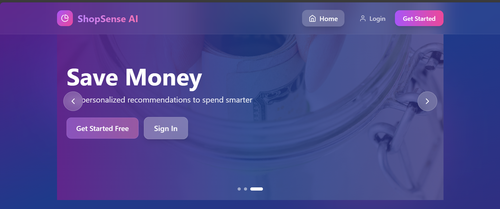
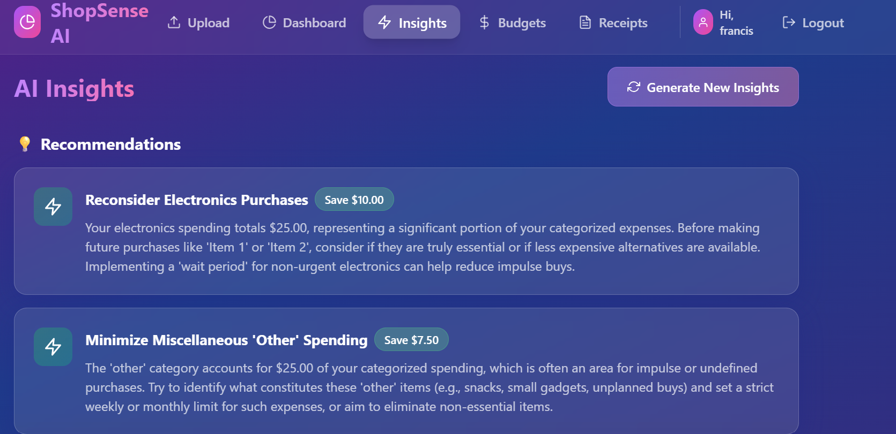
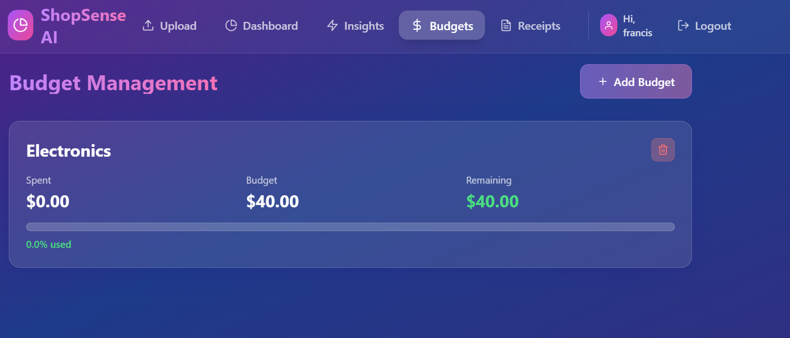
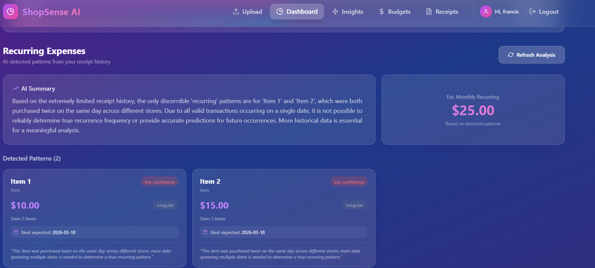

# ShopSense AI 🛍️🤖

An AI-powered shopping behavior tracker that helps you understand your spending patterns and make smarter financial decisions.

> **Built for:** Moringa School — Generative AI Course Final Project  
> **Submission Date:** February 18, 2026  
> **Author:** Francis Mutua

---

## 📸 Screenshots

### Landing Page


### Dashboard & Analytics


### Receipt Upload & AI Scanning


### AI Spending Insights


### Budget Tracking


### Recurring Expense Detector


---

## 🌟 Features

- **📸 Smart Receipt Scanning** — Upload receipt images and let Gemini AI extract all data automatically
- **📊 Visual Analytics Dashboard** — Interactive charts showing spending trends, category breakdowns, and monthly comparisons
- **🤖 AI-Powered Insights** — Get personalized recommendations based on your shopping behavior
- **💰 Budget Tracking with Alerts** — Set budgets per category with visual alerts at 75%, 90%, and 100%
- **🔁 Recurring Expense Detector** — AI detects patterns in your spending and predicts future expenses
- **📄 PDF & CSV Export** — Download professional monthly reports and raw data
- **🔐 User Authentication** — Secure JWT-based login and registration system
- **🎨 Glassmorphism UI** — Beautiful frosted glass design with smooth animations

---

## 🛠️ Tech Stack

### Backend
| Technology | Purpose |
|------------|---------|
| FastAPI | REST API framework |
| SQLAlchemy | Database ORM |
| SQLite | Database (development) |
| Google Gemini AI | Receipt scanning & insights |
| ReportLab | PDF generation |
| python-jose | JWT authentication |
| passlib | Password hashing |

### Frontend
| Technology | Purpose |
|------------|---------|
| React + Vite | UI framework & build tool |
| TailwindCSS | Styling with glassmorphism design |
| Framer Motion | Animations |
| Recharts | Data visualization charts |
| React Router | Navigation |
| Axios | API requests |

---

## 🚀 Quick Start

### Prerequisites
- Python 3.10+
- Node.js 18+
- Gemini API Key — get one free at https://makersuite.google.com/app/apikey

### Backend Setup

```bash
# 1. Navigate to backend
cd backend

# 2. Create and activate virtual environment
python -m venv venv
venv\Scripts\activate        # Windows
source venv/bin/activate     # macOS/Linux

# 3. Install dependencies
pip install -r requirements.txt

# 4. Create your .env file
cp .env.example .env
# Then edit .env and add your GEMINI_API_KEY

# 5. Run the server
python -m app.main
```

Backend runs at: `http://localhost:8000`  
API Docs at: `http://localhost:8000/docs`

### Frontend Setup

```bash
# 1. Navigate to frontend
cd frontend

# 2. Install dependencies
npm install

# 3. Run development server
npm run dev
```

Frontend runs at: `http://localhost:3000`

---

## ⚙️ Environment Variables

Create `backend/.env` with the following:

```env
DATABASE_URL=sqlite:///./shopsense.db
GEMINI_API_KEY=your_gemini_api_key_here
AI_PROVIDER=gemini
SECRET_KEY=your-secret-key-change-in-production
UPLOAD_DIR=uploads
MAX_UPLOAD_SIZE=10485760
```

---

## 📁 Project Structure

```
shopsense-ai/
├── backend/
│   ├── app/
│   │   ├── main.py                    # FastAPI app entry point
│   │   ├── database.py                # Database configuration
│   │   ├── dependencies.py            # JWT auth dependencies
│   │   ├── models/
│   │   │   └── database.py            # SQLAlchemy models
│   │   ├── routers/
│   │   │   ├── auth.py                # Register & login endpoints
│   │   │   ├── receipts.py            # Receipt upload & management
│   │   │   ├── analytics.py           # Spending analytics
│   │   │   ├── insights.py            # AI insights
│   │   │   ├── budgets.py             # Budget tracking
│   │   │   ├── recurring.py           # Recurring expense detection
│   │   │   └── exports.py             # PDF & CSV export
│   │   └── services/
│   │       ├── ai_service.py          # Gemini AI integration
│   │       ├── auth_service.py        # JWT & password logic
│   │       ├── analytics_service.py   # Analytics calculations
│   │       └── recurring_service.py   # Recurring pattern detection
│   ├── uploads/                       # Receipt image storage
│   ├── requirements.txt
│   └── .env.example
├── frontend/
│   ├── src/
│   │   ├── components/
│   │   │   ├── Navigation.jsx         # Navbar (auth-aware)
│   │   │   ├── Dashboard.jsx          # Analytics dashboard
│   │   │   ├── Upload.jsx             # Receipt upload
│   │   │   ├── Insights.jsx           # AI insights
│   │   │   ├── Receipts.jsx           # Receipts list
│   │   │   ├── BudgetAlert.jsx        # Budget alert notifications
│   │   │   ├── ProtectedRoute.jsx     # Auth route guard
│   │   │   └── RecurringExpenses.jsx  # Recurring expense detector
│   │   ├── context/
│   │   │   └── AuthContext.jsx        # Auth state management
│   │   ├── pages/
│   │   │   ├── Home.jsx               # Landing page
│   │   │   ├── Login.jsx              # Login page
│   │   │   ├── Register.jsx           # Register page
│   │   │   └── Budgets.jsx            # Budget management
│   │   ├── services/
│   │   │   └── api.js                 # Axios API client
│   │   ├── App.jsx                    # Routes & providers
│   │   └── index.css                  # Global styles & glass effects
│   ├── package.json
│   ├── vite.config.js
│   └── tailwind.config.js
└── README.md
```

---

## 📖 API Documentation

### Authentication
| Method | Endpoint | Description |
|--------|----------|-------------|
| POST | `/api/auth/register` | Create new account |
| POST | `/api/auth/login` | Login and get JWT token |
| GET | `/api/auth/me` | Get current user info |

### Receipts
| Method | Endpoint | Description |
|--------|----------|-------------|
| POST | `/api/receipts/upload` | Upload & AI-scan receipt image |
| GET | `/api/receipts/` | Get all user receipts |
| DELETE | `/api/receipts/{id}` | Delete a receipt |

### Analytics
| Method | Endpoint | Description |
|--------|----------|-------------|
| GET | `/api/analytics/spending` | Get spending analytics |
| GET | `/api/analytics/categories` | Get category breakdown |

### Budgets
| Method | Endpoint | Description |
|--------|----------|-------------|
| GET | `/api/budgets/` | Get all budgets |
| POST | `/api/budgets/` | Create a budget |
| PUT | `/api/budgets/{id}` | Update a budget |
| DELETE | `/api/budgets/{id}` | Delete a budget |

### Recurring
| Method | Endpoint | Description |
|--------|----------|-------------|
| GET | `/api/recurring/analyze` | AI-detect recurring patterns |

### Exports
| Method | Endpoint | Description |
|--------|----------|-------------|
| GET | `/api/exports/monthly-report-pdf` | Download PDF report |
| GET | `/api/exports/receipts-csv` | Download CSV export |

---

## 🧠 How the AI Works

### Receipt Scanning
1. User uploads a receipt image
2. Image is sent to Google Gemini Vision API
3. Gemini extracts: store name, date, items, prices, categories
4. Structured data is saved to the database
5. Dashboard updates automatically

### Recurring Expense Detection
1. User's full receipt history is compiled
2. Sent to Gemini with a structured analysis prompt
3. Gemini identifies patterns: same stores, same items, regular intervals
4. Returns: frequency, average amount, confidence level, next predicted date
5. Monthly forecast is calculated and displayed

### Spending Insights
1. Category totals and trends are analyzed
2. Gemini identifies impulse purchases and anomalies
3. Personalized recommendations are generated
4. Insights are stored and displayed on the Insights page

---

## 🗄️ Database Schema

```
users
  ├── id, email, username, hashed_password
  └── relationships: receipts, budgets, insights

receipts
  ├── id, user_id, filename, store_name
  ├── purchase_date, total_amount, extracted_text
  └── relationships: items

items
  └── id, receipt_id, name, price, quantity, category

budgets
  └── id, user_id, category, monthly_limit, current_spent

spending_insights
  └── id, user_id, insight_type, title, description, category, amount
```

---

## 🐛 Known Issues & Fixes

| Issue | Fix |
|-------|-----|
| `bcrypt` version conflict with `passlib` | `pip install bcrypt==4.0.1` |
| Gemini 404 model not found | Run model diagnostic script to find available models |
| CORS errors in development | Add `localhost:3000` to FastAPI CORS middleware |
| PDF charts not appearing | Set `matplotlib.use('Agg')` before importing pyplot |
| Gemini 429 quota exceeded | Wait 24hrs for free tier reset or create new API key |

---

## 🚧 Planned Features

- [ ] Shopping Forecast & Monthly Budget Predictor
- [ ] Spending Anomaly Detector
- [ ] Email digest reports (weekly summaries)
- [ ] Multi-currency support
- [ ] Mobile camera capture for receipts
- [ ] PostgreSQL support for production deployment

---

## 📝 License

MIT License — feel free to use this project for your portfolio or learning!

---

## 👤 Author

**Francis Mutua**
- GitHub: [@TechFranc](https://github.com/TechFranc)
- Twitter: [@Fra_nk_lin](https://x.com/Fra_nk_lin)


---

## 🙏 Acknowledgments


- **Google Gemini AI** for the free API tier that powers this app
- **Anthropic Claude** for assistance throughout development
- The **FastAPI** and **React** open source communities

---


⭐ **Star this repo if you found it helpful!**